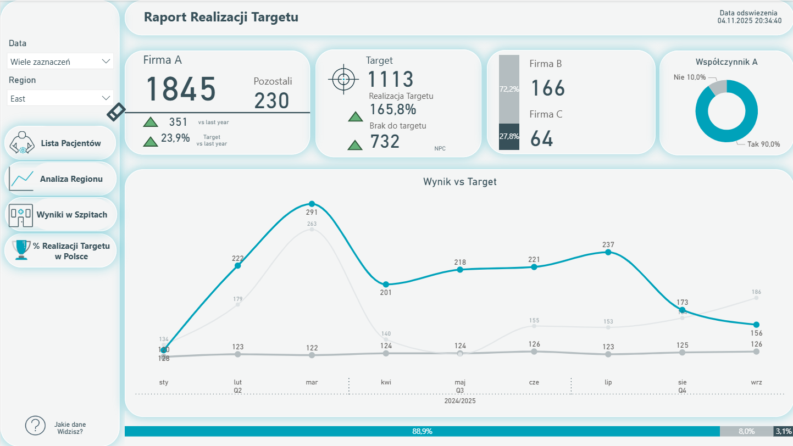
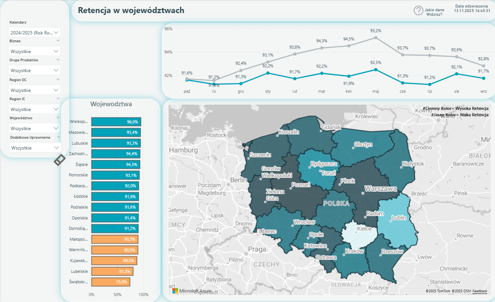
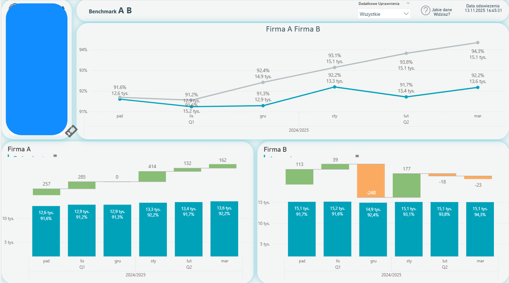

## Krótko o mojej pracy

Łączę kompetencje analityczne, projektowe i technologiczne, tworząc end-to-end rozwiązania wspierające strategiczne decyzje biznesowe.

**Specjalizuję się w:**  
> CRM (Salesforce, Dynamics) – bezpieczeństwo, automatyzacja procesów, integracje  
> Business Intelligence – modelowanie danych, ETL, raportowanie w Power BI”  
> Solution Design – architektura systemów, automatyzacja procesów, wykorzystywanie AI  

Na co dzień używam DAX, M, SQL, VBA oraz narzędzi AI (Copilot, ChatGPT)

Kończąc studia na SGH w kierunku zarządzanie cyberbezpieczeństwem broniłem prace dyplomową w temacie „Ewolucja automatycznego generowania kodu i jej wpływ na bezpieczeństwo”, co w konktekście wykonywanej przezemnie pracy podkreśla moje zainteresowanie innowacjami i cyberbezpieczeństwem przy wsparciu AI

**Core Competencies**  
> **CRM & Automation:** Local CRM, Salesforce, Dynamics 365, Power Automate, Sharepoint  
> **BI & Data:** Power BI, DAX, Power Query (M), ETL orchestration 
> **Solution Design:** projektowanie i rozwój aplikacji biznesowych, automatyzacja procesów, integracje oparte na zdarzeniach (event-driven), wysoka jakość danych (data lineage) oraz zasady security-by-design.

# **1) Zarządzanie i rozwój systemu CRM**
   - Projektuję i rozwijam systemy CRM (Local CRM, Dynamics 365) z naciskiem na architekturę danych, automatyzację procesów oraz bezpieczeństwo. Odpowiadam za pełen cykl życia zmian — od analizy, przez implementację, testy, migracje danych, aż po rollout i monitoring.
   - Integracje local CRM z ERP, centralny hub danych.
   - Rozszerzona analityka biznesowa – dostosowanie CRM do potrzeb raportowania i analizy danych w perspektywie strategicznej.

# **2) Business Intelligence Development- BI Developer**
   - Budowa procesów ETL – integracja danych z wielu źródeł (Local CRM, Salesforce, SharePoint, nazy SQL).
   - Budowa modelu semantycznego, tworzenie miar w języku DAX.
   - Projektowanie dashboardów w Power BI
   
Uruchomiłem aplikacje z raportami PowerBI, przygotowując łacznie 7 raportów oraz niektóre mechanizmy oparte na synchronizacji danych przez BI. Była to duża zmiana technologiczna raportowania danych w Polskim oddziale. Poniżej kilka screenów.*
 

  
  
  

 
<small>*Dane oraz wygląd został zmodyfikowany z uwagi na poufność danych, z tego również powodu nie ma ciekawszych dashboardów. 
</small>

# **3) Project Delivery & Solution Design**.
   - Tworzenie narzędzi automatyzujących procesy biznesowe, wspierające innowacje i zwiększające konkrencyjność (Excel VBA, Power Automate).
   - Projektowanie rozwiązań odpowiadających na potrzeby rynku i strategię firmy.
   - Wdrażanie narzędzi usprawniających operacje i podnoszących efektywność biznesu.

<small>Film zrealizowany przez firmę prezentujący jednego z rozwiązań. Link przenosi do poratlu YouTube*  
*Część danych została ukryta ze względu na poufność.
</small>

<!--
Tu masz opcje do wyświetlania w MD: 
-->
